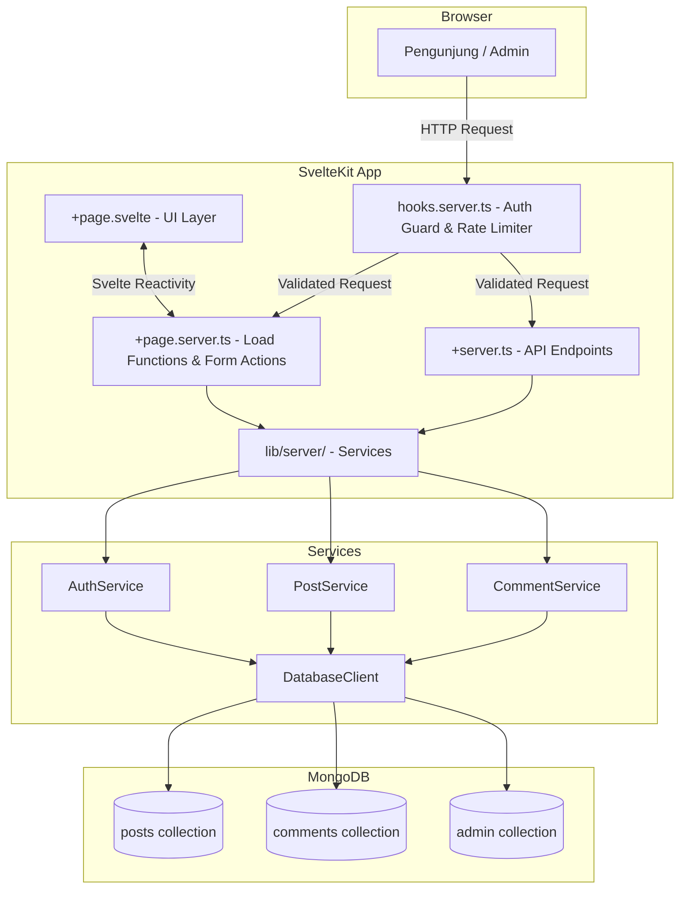
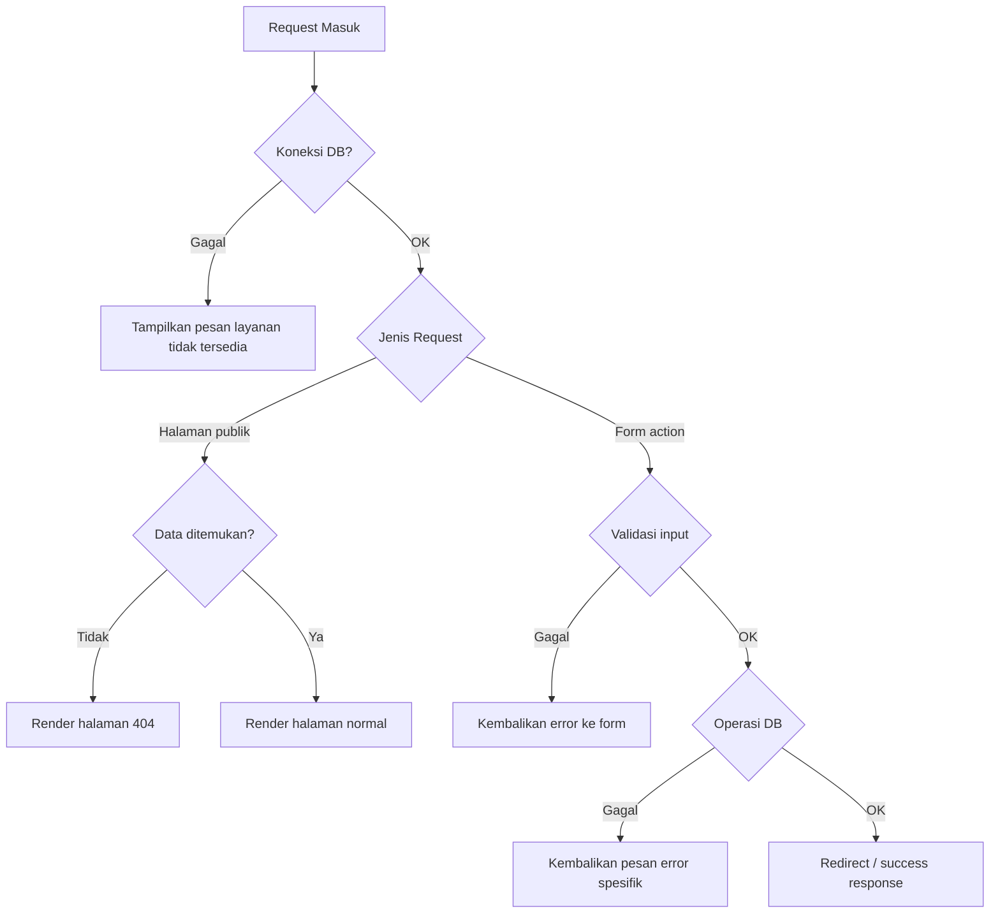

# Dokumen Desain Teknis: Personal Writing Platform

## Overview

Personal Writing Platform adalah aplikasi web blog pribadi yang dibangun di atas SvelteKit (full-stack), Tailwind CSS, dan MongoDB. Platform ini dirancang untuk satu penulis (Admin) yang ingin mempublikasikan tulisan dalam tiga kategori tematik, sementara pengunjung publik dapat membaca dan meninggalkan komentar tanpa registrasi.

### Tujuan Desain

- **Minimalis dan cepat**: Halaman publik harus ringan, server-side rendered, dan mudah dibaca.
- **Aman**: Autentikasi berbasis sesi dengan cookie HttpOnly, proteksi XSS, dan rate limiting.
- **Mudah dikelola**: Admin memiliki antarmuka CRUD yang sederhana dengan pratinjau Markdown langsung.
- **Responsif**: Berfungsi baik di semua ukuran layar (320px–2560px) dengan dukungan dark mode.

### Ringkasan Keputusan Teknis

| Keputusan | Pilihan | Alasan |
|---|---|---|
| Bahasa | JavaScript (ES Modules, tanpa TypeScript) | Lebih sederhana, tidak perlu kompilasi tipe, cocok untuk proyek personal |
| Markdown parser | `marked` + `DOMPurify` | `marked` cepat dan populer; `DOMPurify` wajib karena `marked` tidak sanitize output secara default |
| Autentikasi | Session cookie (HttpOnly, SameSite=Strict) | Lebih aman dari JWT di localStorage; SvelteKit mendukung `cookies` API secara native |
| Rate limiting | `sveltekit-rate-limiter` | Library modular khusus SvelteKit, berbasis in-memory per IP |
| MongoDB driver | `mongoose` | ODM yang menyediakan schema validation, model, dan query builder yang lebih ekspresif |
| Slug generation | `slugify` | Library ringan untuk menghasilkan slug URL-safe dari judul |
| Input sanitization | `isomorphic-dompurify` | Berjalan di server (Node.js) maupun browser |

---

## Architecture

Platform menggunakan arsitektur **full-stack monolith** dengan SvelteKit sebagai satu-satunya server. Tidak ada backend terpisah.



### Alur Request Utama

**Halaman Publik (SSR)**:
1. Browser → `hooks.server.ts` (cek sesi jika ada)
2. → `+page.server.ts` load function → PostService/CommentService
3. → MongoDB query → data dikembalikan ke halaman
4. SvelteKit merender HTML di server, dikirim ke browser

**Form Action (Komentar/Login)**:
1. Browser POST → `hooks.server.ts` (rate limiter untuk komentar)
2. → `+page.server.ts` form action → validasi → Service
3. → MongoDB write → redirect atau error response

**Admin Routes**:
1. Browser → `hooks.server.ts` → cek cookie sesi
2. Jika tidak valid → redirect ke `/admin/login`
3. Jika valid → lanjut ke load function / form action

---

## Components and Interfaces

### Struktur Direktori

```
src/
├── lib/
│   ├── server/
│   │   ├── db.js              # Mongoose connection singleton
│   │   ├── models/
│   │   │   ├── Post.js        # Mongoose Post model & schema
│   │   │   ├── Comment.js     # Mongoose Comment model & schema
│   │   │   ├── AdminUser.js   # Mongoose AdminUser model & schema
│   │   │   └── Session.js     # Mongoose Session model & schema
│   │   ├── auth.service.js    # AuthService
│   │   ├── post.service.js    # PostService
│   │   ├── comment.service.js # CommentService
│   │   └── rate-limiter.js    # Rate limiter instance
│   ├── utils/
│   │   ├── markdown.js        # marked + DOMPurify wrapper
│   │   ├── slug.js            # Slug generation utility
│   │   └── sanitize.js        # Input sanitization helpers
│   └── components/
│       ├── PostCard.svelte    # Kartu postingan di daftar
│       ├── PostContent.svelte # Render konten Markdown
│       ├── CommentForm.svelte # Formulir komentar
│       ├── CommentList.svelte # Daftar komentar
│       ├── CategoryNav.svelte # Navigasi kategori
│       ├── DarkModeToggle.svelte
│       └── MarkdownEditor.svelte # Editor + preview untuk admin
├── routes/
│   ├── +layout.svelte         # Root layout (dark mode, nav)
│   ├── +layout.server.js      # Load sesi untuk layout
│   ├── +page.svelte           # Halaman utama
│   ├── +page.server.js        # Load daftar postingan
│   ├── [slug]/
│   │   ├── +page.svelte       # Halaman detail postingan
│   │   └── +page.server.js    # Load postingan + komentar, form action komentar
│   └── admin/
│       ├── +layout.svelte     # Admin layout
│       ├── +layout.server.js  # Auth guard
│       ├── login/
│       │   ├── +page.svelte
│       │   └── +page.server.js # Form action login
│       ├── +page.svelte       # Dasbor admin (daftar postingan)
│       ├── +page.server.js
│       ├── posts/
│       │   ├── new/
│       │   │   ├── +page.svelte
│       │   │   └── +page.server.js # Form action create post
│       │   └── [id]/
│       │       ├── +page.svelte
│       │       └── +page.server.js # Form action edit/delete post
│       └── logout/
│           └── +page.server.js # Form action logout
└── hooks.server.js            # Auth check + rate limiter
```

### Interface Service (JSDoc)

```js
// lib/server/auth.service.js
// verifyCredentials(username, password) → Promise<boolean>
// createSession(event) → Promise<string>  // returns sessionId
// validateSession(sessionId) → Promise<boolean>
// destroySession(event) → Promise<void>

// lib/server/post.service.js
// listPosts(category?) → Promise<PostSummary[]>
// getPostBySlug(slug) → Promise<Post | null>
// createPost({ title, content, category }) → Promise<Post>
// updatePost(id, { title?, content?, category? }) → Promise<Post | null>
// deletePost(id) → Promise<boolean>
// generateUniqueSlug(title) → Promise<string>

// lib/server/comment.service.js
// getCommentsByPostId(postId) → Promise<Comment[]>
// addComment({ postId, authorName, content }) → Promise<Comment>
```

### Komponen UI Utama

**`DarkModeToggle.svelte`**
- Membaca preferensi dari `localStorage` saat mount
- Jika tidak ada, membaca `prefers-color-scheme` via `window.matchMedia`
- Toggle menambah/menghapus class `dark` pada `<html>` element
- Menyimpan pilihan ke `localStorage`

**`MarkdownEditor.svelte`**
- Split-pane: textarea kiri, preview kanan
- Preview diperbarui secara reaktif menggunakan `marked` + `DOMPurify`
- Menggunakan `{@html sanitizedHtml}` untuk render preview

**`CommentForm.svelte`**
- Progressive enhancement dengan SvelteKit `use:enhance`
- Setelah submit berhasil, komentar baru ditambahkan ke daftar tanpa reload halaman
- Validasi client-side sebelum submit

---

## Data Models

### Mongoose Schemas

#### Model: `Post` (`src/lib/server/models/Post.js`)

```js
import mongoose from 'mongoose';

const PostSchema = new mongoose.Schema({
  title:     { type: String, required: true },
  slug:      { type: String, required: true, unique: true },
  content:   { type: String, required: true },
  category:  { type: String, enum: ['essay', 'poetry', 'story'], required: true },
  excerpt:   { type: String, required: true },
}, { timestamps: true }); // adds createdAt and updatedAt automatically

// Indexes
PostSchema.index({ category: 1, createdAt: -1 });
PostSchema.index({ createdAt: -1 });

export const Post = mongoose.model('Post', PostSchema);
```

**Kategori label**:
```js
export const CATEGORY_LABELS = {
  essay:   'Apa yang aku pikirkan',
  poetry:  'Apa yang aku rasakan',
  story:   'Apa yang aku bayangkan',
};
```

#### Model: `Comment` (`src/lib/server/models/Comment.js`)

```js
import mongoose from 'mongoose';

const CommentSchema = new mongoose.Schema({
  postId:     { type: mongoose.Schema.Types.ObjectId, ref: 'Post', required: true },
  authorName: { type: String, default: 'Anonym' },
  content:    { type: String, required: true },
}, { timestamps: { createdAt: true, updatedAt: false } });

CommentSchema.index({ postId: 1, createdAt: 1 });

export const Comment = mongoose.model('Comment', CommentSchema);
```

#### Model: `AdminUser` (`src/lib/server/models/AdminUser.js`)

```js
import mongoose from 'mongoose';

const AdminUserSchema = new mongoose.Schema({
  username:     { type: String, required: true, unique: true },
  passwordHash: { type: String, required: true },
});

export const AdminUser = mongoose.model('AdminUser', AdminUserSchema);
```

#### Model: `Session` (`src/lib/server/models/Session.js`)

```js
import mongoose from 'mongoose';

const SessionSchema = new mongoose.Schema({
  _id:       { type: String },  // sessionId (random UUID)
  adminId:   { type: mongoose.Schema.Types.ObjectId, ref: 'AdminUser', required: true },
  expiresAt: { type: Date, required: true },
});

// TTL index — MongoDB auto-deletes expired sessions
SessionSchema.index({ expiresAt: 1 }, { expireAfterSeconds: 0 });

export const Session = mongoose.model('Session', SessionSchema);
```

### DTOs (plain JS objects)

```js
// Input untuk membuat postingan baru
// { title: string, content: string, category: 'essay'|'poetry'|'story' }

// Input untuk komentar baru
// { postId: string, authorName: string, content: string }

// Summary untuk daftar postingan (tanpa konten penuh)
// { _id: string, title, slug, category, excerpt, createdAt }
```

---

## Correctness Properties

*A property is a characteristic or behavior that should hold true across all valid executions of a system — essentially, a formal statement about what the system should do. Properties serve as the bridge between human-readable specifications and machine-verifiable correctness guarantees.*

### Property 1: Slug Uniqueness After Generation

*For any* set of existing slugs and any new post title, the generated slug SHALL NOT collide with any existing slug in the database.

**Validates: Requirements 5.3, 5.4**

---

### Property 2: Komentar Kosong Ditolak

*For any* string yang terdiri seluruhnya dari whitespace (spasi, tab, newline), mengirimkannya sebagai konten komentar SHALL menghasilkan penolakan dan daftar komentar tidak berubah.

**Validates: Requirements 3.6**

---

### Property 3: Nama Komentar Default "Anonym"

*For any* komentar yang dikirim dengan kolom nama kosong atau hanya whitespace, nama yang tersimpan di database SHALL selalu berupa string "Anonym".

**Validates: Requirements 3.5**

---

### Property 4: Filter Kategori Konsisten

*For any* kategori yang dipilih, semua postingan yang dikembalikan SHALL memiliki kategori yang sama persis dengan kategori yang diminta, dan tidak ada postingan dari kategori lain yang muncul.

**Validates: Requirements 1.4**

---

### Property 5: Urutan Postingan Terbaru

*For any* daftar postingan yang dikembalikan (dengan atau tanpa filter kategori), setiap postingan pada indeks `i` SHALL memiliki `createdAt` yang lebih baru atau sama dengan postingan pada indeks `i+1`.

**Validates: Requirements 1.1**

---

### Property 6: Urutan Komentar Terlama ke Terbaru

*For any* daftar komentar untuk sebuah postingan, setiap komentar pada indeks `i` SHALL memiliki `createdAt` yang lebih lama atau sama dengan komentar pada indeks `i+1`.

**Validates: Requirements 3.8**

---

### Property 7: XSS Sanitization pada Komentar

*For any* string input komentar yang mengandung tag HTML atau skrip berbahaya (misalnya `<script>`, `onerror=`, `javascript:`), konten yang tersimpan di database SHALL tidak mengandung tag atau atribut yang dapat mengeksekusi skrip.

**Validates: Requirements 8.1**

---

### Property 8: Markdown Render Round-Trip Konsisten

*For any* string Markdown yang valid, memanggil fungsi render dua kali berturut-turut dengan input yang sama SHALL menghasilkan output HTML yang identik (idempoten).

**Validates: Requirements 2.2, 2.3**

---

### Property 9: Proteksi Rute Admin

*For any* request ke rute di bawah `/admin` (kecuali `/admin/login`) tanpa cookie sesi yang valid, sistem SHALL mengembalikan redirect ke `/admin/login` dan tidak pernah mengembalikan konten halaman admin.

**Validates: Requirements 4.7**

---

## Error Handling

### Strategi Penanganan Error



### Error Codes dan Pesan

| Skenario | Pesan kepada Pengguna | HTTP Status |
|---|---|---|
| Postingan tidak ditemukan | "Tulisan tidak ditemukan." | 404 |
| Koneksi DB gagal (publik) | "Layanan sedang tidak tersedia. Silakan coba lagi nanti." | 503 |
| Koneksi DB gagal (admin save) | "Gagal menyimpan postingan. Silakan coba lagi." | 500 |
| Login gagal | "Nama pengguna atau kata sandi salah." | 400 |
| Komentar kosong | "Komentar tidak boleh kosong." | 400 |
| Rate limit terlampaui | "Terlalu banyak permintaan. Silakan tunggu sebentar." | 429 |
| Akses admin tanpa sesi | Redirect ke `/admin/login` | 302 |

### Penanganan Error Database

```js
// lib/server/db.js - Mongoose connection singleton
import mongoose from 'mongoose';

let connected = false;

export async function connectDb() {
  if (connected) return;
  await mongoose.connect(process.env.MONGODB_URI);
  connected = true;
}
```

Setiap service memanggil `connectDb()` di awal operasi dan membungkus query dalam try/catch, melempar error yang sudah dideskripsikan untuk ditangani di form action.

### Error Boundary di SvelteKit

- `src/routes/+error.svelte` — halaman error global untuk 404, 500, dll.
- Setiap `+page.server.ts` menggunakan `error()` dari `@sveltejs/kit` untuk 404
- Form actions mengembalikan `fail()` untuk error validasi (tidak throw)

---

## Testing Strategy

### Pendekatan Pengujian

Platform ini menggunakan **dual testing approach**:

1. **Unit Tests** — untuk logika bisnis murni (slug generation, sanitization, validasi)
2. **Property-Based Tests** — untuk properti universal yang harus berlaku di semua input
3. **Integration Tests** — untuk interaksi dengan MongoDB (menggunakan MongoDB in-memory)

### Library yang Digunakan

| Library | Tujuan |
|---|---|
| `vitest` | Test runner utama (terintegrasi dengan Vite/SvelteKit) |
| `fast-check` | Property-based testing library untuk JavaScript |
| `mongodb-memory-server` | MongoDB in-memory untuk integration tests |
| `@testing-library/svelte` | Testing komponen Svelte |

### Property-Based Tests (fast-check)

Setiap property test dikonfigurasi dengan minimum **100 iterasi**. Setiap test diberi tag komentar yang mereferensikan property di dokumen desain ini.

**Format tag**: `// Feature: personal-writing-platform, Property {N}: {deskripsi singkat}`

#### Property 1: Slug Uniqueness
```js
// Feature: personal-writing-platform, Property 1: slug uniqueness after generation
it('slug yang dihasilkan tidak pernah bertabrakan dengan slug yang sudah ada', async () => {
  await fc.assert(
    fc.asyncProperty(
      fc.array(fc.string({ minLength: 1 }), { minLength: 0, maxLength: 50 }),
      fc.string({ minLength: 1 }),
      async (existingSlugs, newTitle) => {
        const slug = generateUniqueSlug(newTitle, existingSlugs);
        expect(existingSlugs).not.toContain(slug);
      }
    ),
    { numRuns: 100 }
  );
});
```

#### Property 2 & 3: Validasi Komentar
```js
// Feature: personal-writing-platform, Property 2: whitespace comment rejection
it('komentar yang hanya berisi whitespace selalu ditolak', () => {
  fc.assert(
    fc.property(
      fc.stringOf(fc.constantFrom(' ', '\t', '\n', '\r')),
      (whitespaceStr) => {
        const result = validateCommentContent(whitespaceStr);
        expect(result.valid).toBe(false);
      }
    ),
    { numRuns: 100 }
  );
});

// Feature: personal-writing-platform, Property 3: empty name defaults to Anonym
it('nama kosong atau whitespace selalu menghasilkan "Anonym"', () => {
  fc.assert(
    fc.property(
      fc.oneof(
        fc.constant(''),
        fc.stringOf(fc.constantFrom(' ', '\t', '\n'))
      ),
      (emptyName) => {
        const result = normalizeAuthorName(emptyName);
        expect(result).toBe('Anonym');
      }
    ),
    { numRuns: 100 }
  );
});
```

#### Property 4 & 5: Filter dan Urutan Postingan
```js
// Feature: personal-writing-platform, Property 4: category filter consistency
it('filter kategori hanya mengembalikan postingan dengan kategori yang diminta', () => {
  fc.assert(
    fc.property(
      fc.array(arbitraryPost(), { minLength: 0, maxLength: 100 }),
      fc.constantFrom('essay', 'poetry', 'story'),
      (posts, category) => {
        const filtered = filterPostsByCategory(posts, category);
        expect(filtered.every(p => p.category === category)).toBe(true);
      }
    ),
    { numRuns: 100 }
  );
});

// Feature: personal-writing-platform, Property 5: posts sorted newest first
it('daftar postingan selalu diurutkan dari terbaru ke terlama', () => {
  fc.assert(
    fc.property(
      fc.array(arbitraryPost(), { minLength: 2, maxLength: 100 }),
      (posts) => {
        const sorted = sortPostsByDate(posts);
        for (let i = 0; i < sorted.length - 1; i++) {
          expect(sorted[i].createdAt.getTime()).toBeGreaterThanOrEqual(
            sorted[i + 1].createdAt.getTime()
          );
        }
      }
    ),
    { numRuns: 100 }
  );
});
```

#### Property 6: Urutan Komentar
```js
// Feature: personal-writing-platform, Property 6: comments sorted oldest first
it('komentar selalu diurutkan dari terlama ke terbaru', () => {
  fc.assert(
    fc.property(
      fc.array(arbitraryComment(), { minLength: 2, maxLength: 200 }),
      (comments) => {
        const sorted = sortCommentsByDate(comments);
        for (let i = 0; i < sorted.length - 1; i++) {
          expect(sorted[i].createdAt.getTime()).toBeLessThanOrEqual(
            sorted[i + 1].createdAt.getTime()
          );
        }
      }
    ),
    { numRuns: 100 }
  );
});
```

#### Property 7: XSS Sanitization
```js
// Feature: personal-writing-platform, Property 7: XSS sanitization on comments
it('input komentar yang mengandung skrip berbahaya selalu disanitasi', () => {
  fc.assert(
    fc.property(
      fc.string().map(s => `<script>${s}</script>${s}`),
      (maliciousInput) => {
        const sanitized = sanitizeCommentContent(maliciousInput);
        expect(sanitized).not.toMatch(/<script/i);
        expect(sanitized).not.toMatch(/onerror/i);
        expect(sanitized).not.toMatch(/javascript:/i);
      }
    ),
    { numRuns: 100 }
  );
});
```

#### Property 8: Markdown Render Idempoten
```js
// Feature: personal-writing-platform, Property 8: markdown render idempotent
it('render Markdown menghasilkan output yang sama jika dipanggil dua kali', () => {
  fc.assert(
    fc.property(
      fc.string(),
      (markdownInput) => {
        const firstRender = renderMarkdown(markdownInput);
        const secondRender = renderMarkdown(markdownInput);
        expect(firstRender).toBe(secondRender);
      }
    ),
    { numRuns: 100 }
  );
});
```

#### Property 9: Proteksi Rute Admin
```js
// Feature: personal-writing-platform, Property 9: admin route protection
it('semua rute admin tanpa sesi valid selalu di-redirect ke login', async () => {
  const adminRoutes = ['/admin', '/admin/posts/new', '/admin/posts/some-id'];
  fc.assert(
    fc.property(
      fc.constantFrom(...adminRoutes),
      fc.string(), // invalid session token
      async (route, invalidToken) => {
        const response = await simulateRequest(route, invalidToken);
        expect(response.status).toBe(302);
        expect(response.headers.get('location')).toBe('/admin/login');
      }
    ),
    { numRuns: 100 }
  );
});
```

### Unit Tests

- `slug.ts` — generateSlug, generateUniqueSlug dengan sufiks numerik
- `sanitize.ts` — sanitizeCommentContent, normalizeAuthorName
- `markdown.ts` — renderMarkdown dengan berbagai elemen Markdown standar
- `auth.service.ts` — verifyCredentials dengan hash bcrypt

### Integration Tests (MongoDB in-memory)

- PostService CRUD operations
- CommentService add + list
- Session creation dan validation
- Cascade delete (post + komentar terkait)

### Komponen Tests (@testing-library/svelte)

- `CommentForm.svelte` — validasi client-side, submit behavior
- `DarkModeToggle.svelte` — toggle state, localStorage persistence
- `CategoryNav.svelte` — filter selection
- `MarkdownEditor.svelte` — preview update reaktif
